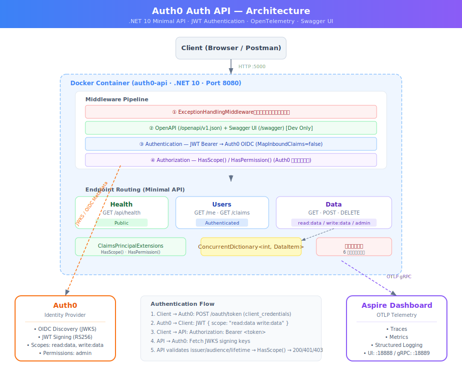

# Auth0 Auth API

.NET 10 Minimal API 演示 Auth0 JWT 认证与基于 scope/permission 的授权。
A .NET 10 Minimal API demonstrating Auth0 JWT authentication with scope/permission-based authorization.



## Tech Stack

| 技术 | 用途 |
|------|------|
| .NET 10 Minimal API | Web 框架 |
| JWT Bearer (Auth0) | 认证与授权 |
| Scalar | API 文档 UI（替代 Swagger） |
| OpenTelemetry | 分布式追踪与指标 |
| Aspire Dashboard | 遥测可视化 |
| Docker / Docker Compose | 容器化部署 |

## Architecture

```
Request → ExceptionHandling → Authentication(JWT) → Authorization(Scope) → Endpoint
                                                                       ↓
                                                              In-Memory Data Store
                                                                       ↓
                                                         OpenTelemetry → Aspire Dashboard
```

### Project Structure

| 模块 | 职责 |
|------|------|
| `Program.cs` | 应用入口，DI 注册，中间件配置 |
| `Endpoints/HealthEndpoints.cs` | 公开健康检查端点 |
| `Endpoints/UserEndpoints.cs` | 认证用户信息端点 |
| `Endpoints/DataEndpoints.cs` | 基于 scope 的 CRUD 数据端点 |
| `Extensions/ClaimsPrincipalExtensions.cs` | Auth0 scope claim 解析扩展 |
| `Middleware/ExceptionHandlingMiddleware.cs` | 全局异常处理 |
| `Models/Auth0Options.cs` | Auth0 配置模型 |

## Quick Start

### 前置条件

- .NET 10 SDK
- Docker & Docker Compose
- [Auth0](https://auth0.com/) 账号

### 配置

1. 复制并填写 `.env` 文件：

```bash
AUTH0_DOMAIN=your-tenant.auth0.com
AUTH0_AUDIENCE=https://your-api-identifier
AUTH0_CLIENT_ID=your-client-id
AUTH0_CLIENT_SECRET=your-client-secret
```

2. 在 Auth0 Dashboard 中：
   - 创建 API，Identifier 设为 `AUTH0_AUDIENCE` 的值
   - 添加 Permissions: `read:data`, `write:data`
   - 创建 Application（Machine to Machine），授权访问 API 并勾选 scopes

### 本地运行

```bash
dotnet build Auth0.Auth.Api/Auth0.Auth.Api.csproj
dotnet run --project Auth0.Auth.Api/Auth0.Auth.Api.csproj
```

### Docker 运行

```bash
docker-compose up --build
```

| 服务 | 地址 |
|------|------|
| API | http://localhost:5000 |
| Scalar UI | http://localhost:5000/scalar/v1 |
| Aspire Dashboard | http://localhost:18888 |

## API Endpoints

| Method | Path | Auth | Scope | Description |
|--------|------|------|-------|-------------|
| `GET` | `/api/health` | None | — | 健康检查 |
| `GET` | `/api/users/me` | JWT | — | 当前用户信息与 Claims |
| `GET` | `/api/users/claims` | JWT | — | 按 Claim 类型分组 |
| `GET` | `/api/data/` | JWT | `read:data` | 读取所有数据 |
| `POST` | `/api/data/` | JWT | `write:data` | 写入新数据 |
| `DELETE` | `/api/data/purge` | JWT | `admin` | 清除所有数据 |

## Example

获取 token（使用 Auth0 Test Application 的凭据）：

```bash
curl -X POST https://your-tenant.auth0.com/oauth/token \
  -H "content-type: application/json" \
  -d '{
    "client_id": "<client_id>",
    "client_secret": "<client_secret>",
    "audience": "https://your-api-identifier",
    "grant_type": "client_credentials"
  }'
```

访问受保护的端点：

```bash
curl http://localhost:5000/api/data \
  -H "Authorization: Bearer <access_token>"
```

响应：

```json
{
  "message": "数据读取成功",
  "data": [
    { "id": 1, "name": "Item 1", "value": "Value 1" },
    { "id": 2, "name": "Item 2", "value": "Value 2" },
    { "id": 3, "name": "Item 3", "value": "Value 3" }
  ],
  "count": 3,
  "timestamp": "2026-06-06T05:08:46.9980539Z"
}
```

## License

MIT
